[](https://circleci.com/gh/mozilla/debug-ping-view)
# Glean Debug View
Web application for viewing Glean debug pings in real-time.

## Contributing
Since this repository is private, CircleCI is not able to build from forks. As a workaround PRs should be submitted from branches pushed to origin.

## Development

**Required node version**: 14.20.1

### Clean checkout
If you just cloned this repository, first you should install dependencies:
 ```
 npm install
 cd functions && npm install && cd ..
 ```

Run the following command to generate required Glean files (needs re-ran anytime Glean `.yaml` files are updated):
 ```
 npm run build:glean
 ```

### Local hosting
Run React application locally:
```
npm start
```
Application will start connected to development project. For details, including building and deployment, see [Deployment](doc/deployment.md).

Send debug ping to GCP ingestion:
```
curl --header 'X-Debug-ID: test-debug-id' -XPOST https://incoming.telemetry.mozilla.org/submit/glean/events/1/$(uuidgen) -d '{"$schema":"moz://mozilla.org/schemas/glean/ping/1","client_info":{"app_build":"59f330e5","app_display_version":"1.0.0","architecture":"arm","client_id":"6ff20eb7-e80d-4452-b45f-2ea7e63547aa","device_manufacturer":"Mozilla","device_model":"phone123","first_run_date":"2018-10-23-04:25","os":"Android","os_version":"3.2.1","telemetry_sdk_build":"abcdabcd"},"ping_info":{"ping_type":"full","seq":1,"start_time":"2018-10-23 11:23:15-04:00","end_time":"2018-10-23 11:23:15-04:25","experiments":{"experiment1":{"branch":"branch_a"},"experiment2":{"branch":"branch_b","extra":{"type":"experiment_type"}}}},"events":[{"timestamp":123456789,"category":"examples","name":"event_example","extra":{"metadata1":"extra","metadata2":"more_extra"}},{"timestamp":123456791,"category":"examples","name":"event_example"}]}'
```

## Architecture
Clients are submitting pings to [Mozilla telemetry ingestion system](https://github.com/mozilla/gcp-ingestion). Pings tagged with `X-Debug-ID` header (e.g. `X-Debug-ID: test-name`) are picked up by [`debugPing` function](functions/index.js) and loaded to [Firestore](https://firebase.google.com/docs/firestore/).

Frontend is implemented with [React](https://reactjs.org/) hosted on [Firebase](https://firebase.google.com/docs/hosting/), it leverages Firestore's real-time query update capability.



### Ingestion and data model
Pings from `structured-decoded-debug` and `structured-error` topics are pushed to [HTTP Functions](functions/index.js) via [Push Subscriptions](https://cloud.google.com/pubsub/docs/subscriber#push-subscription). We can't use PubSub-triggered function here because it doesn't support cross-project access.

For more information about the functions, see [functions/README.md](functions/README.md).

Glean debug pings with some fields extracted are stored in Firestore. There are two collections with flat documents used:
```
clients
+ key: string // {client_id}_{debug_id}
+ appName: string
+ debugId: string // value of the `X-Debug-ID` header
+ geo: string // city and country of the last submitted ping, from GeoIP
+ lastActive: string // timestamp of the last ping submission
+ os: string
```
```
pings
+ key: string // document_id
+ addedAt: string // submission timestamp
+ debugId: string
+ payload: string // submitted ping payload
+ pingType: string // document_type
```
Ping collection is [indexed](firestore.indexes.json).

### Data expiration
Pings are retained for a limited time. Every day, a [function](functions/garbageCollector.js) that deletes pings and client entries modified earlier than 21 days ago is triggered via Cloud Scheduler.

### Web application
Views are leveraging Firestore's realtime query updates.

#### Authentication
Simple Google Signin-based authentication is inplace. It allows to log in with any Google account, although only those under `mozilla.com` domain are [allowed](firestore.rules) to fetch data from Firestore.

#### Data Collection
This project uses [Glean.js SDK](https://github.com/mozilla/glean.js) for data collection. If you want to disable data collection, please [turn on browser's Do Not Track](https://support.mozilla.org/en-US/kb/how-do-i-turn-do-not-track-feature) feature.
